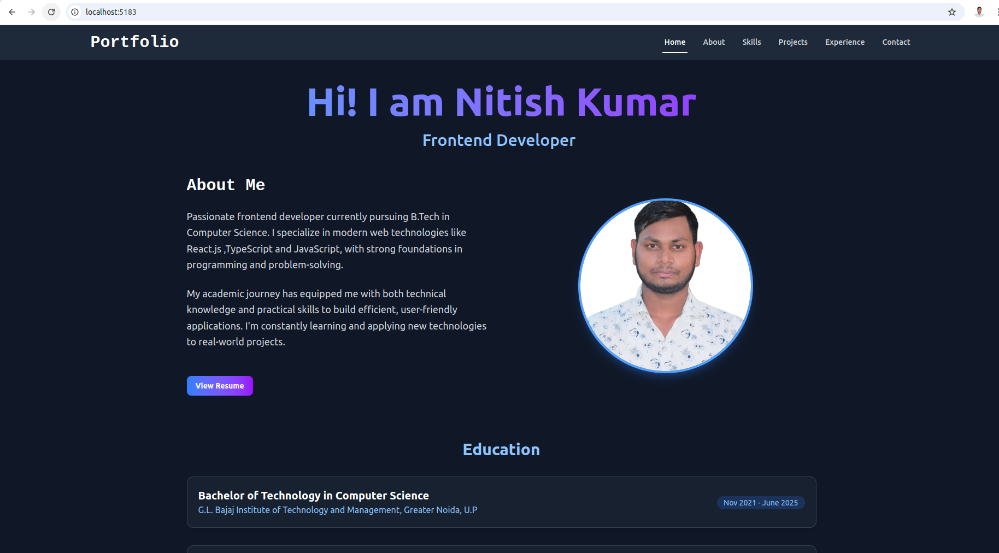
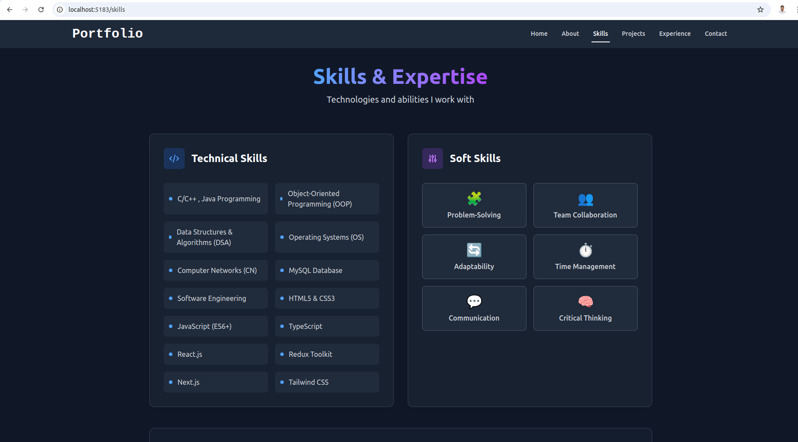

# Nitish Kumar - Portfolio

## 🌟 About This Project

Welcome to my professional portfolio website! This modern, responsive web application showcases my skills, projects, experience, and contact information. Built with React.js and Tailwind CSS, it features smooth animations, interactive components, and a clean design that highlights my work as a frontend developer.

## ✨ Features

- **Modern UI/UX Design**: Clean, professional interface with dark mode aesthetics
- **Interactive Components**: Animated sections using Framer Motion
- **Responsive Layout**: Fully responsive across all device sizes
- **Skills Visualization**: Organized technical and soft skills display
- **Project Showcase**: Detailed project cards with technologies used
- **Contact Form**: Easy way to get in touch 
- **Performance Optimized**: Fast loading with lazy loading components

## 🛠️ Technologies Used

- **Frontend**: 
  - React.js
  - Tailwind CSS
  - Framer Motion (animations)
  - React Icons
- **Build Tools**:
  - Vite (for fast development)
  - npm (package management)

## 🚀 Getting Started

### Prerequisites

- Node.js (v16 or higher)
- npm (v8 or higher)

### Installation

1. Clone the repository:
   git clone https://github.com/nitissk/portfolio.git
   

2. Navigate to the project directory:
   cd portfolio
   

3. Install dependencies:
   npm install
   

4. Start the development server:
   npm run dev
   

5. Open your browser and visit: 
   http://localhost:3000
   

## 📂 Project Structure

portfolio/
├── public/            # Static assets
├── src/
│   ├── assets/        # Images and fonts
│   ├── components/    # Reusable components
│   │   ├── pages/     # Data files (projects, skills, etc.)             
│   ├── App.jsx        # Main app component
│   └── main.jsx       # Entry point
├── .gitignore
├── index.html
├── package.json
├── README.md
└── vite.config.js

## 🎨 Customization

To personalize this portfolio:

1. Update your information in:
   - `src/constants/pages/contactInfo.js`
   - `src/constants/pages/experiences.js`
   - `src/constants/pages/projects.js`
   - `src/constants/pages/skills.js`

2. Replace the profile image in `src/assets/`

3. Modify colors in `tailwind.config.js`

## 📄 License

This project is licensed under the MIT License - see the [LICENSE](LICENSE) file for details.

## 🤝 Connect With Me

---

⭐ Feel free to star this repository if you find it useful! Contributions and suggestions are always welcome.